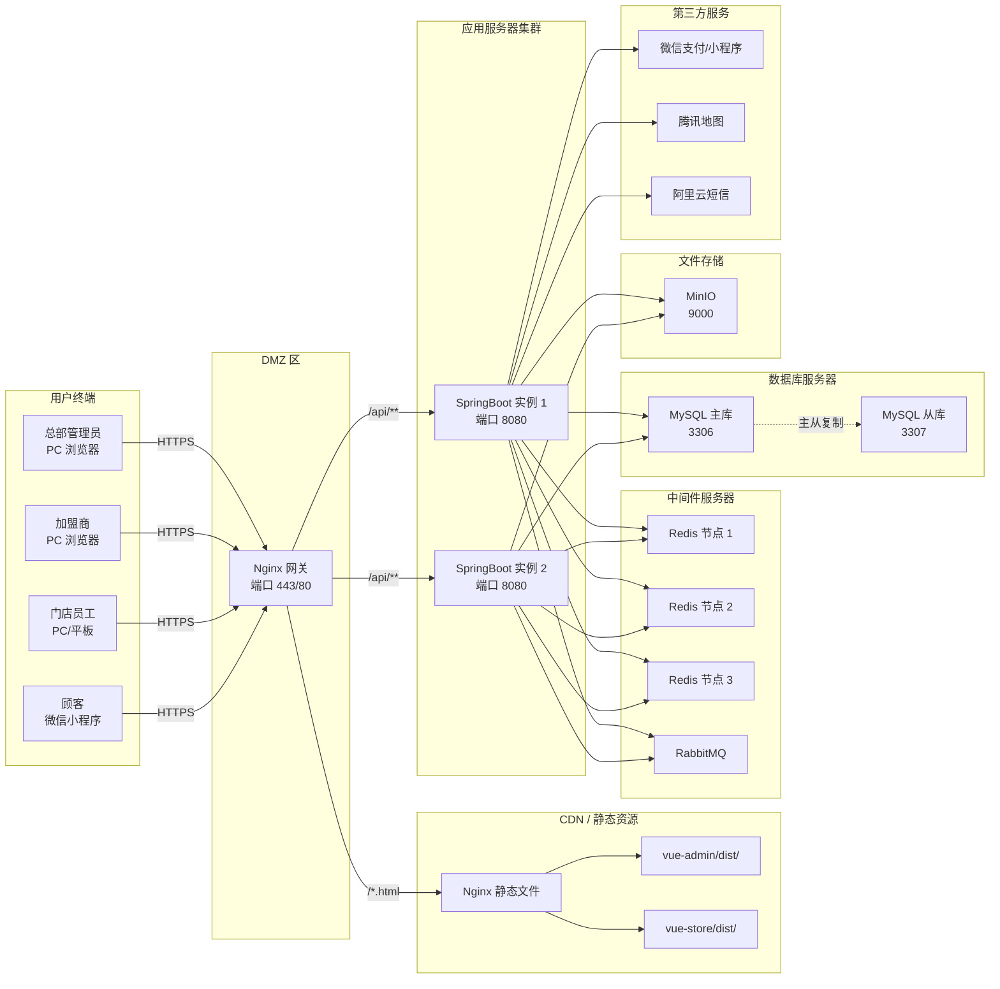
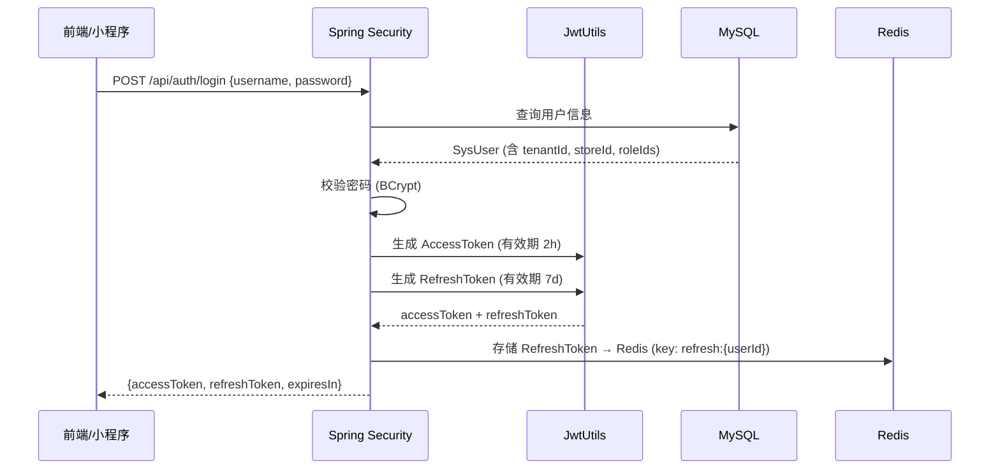
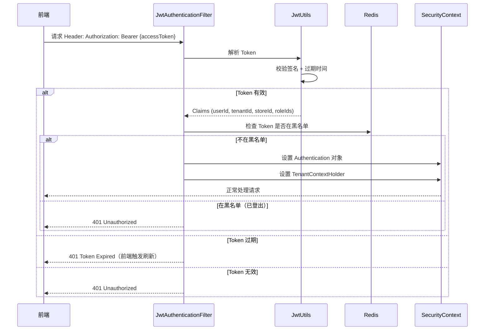
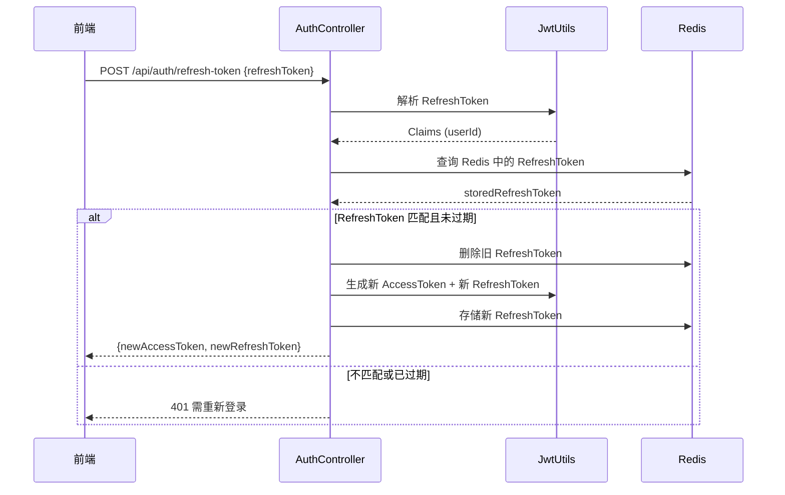

### 总部与加盟商的租户模型

```
总部管理员（tenant_id = 0）
  |
  |-- 特殊权限：可通过 ignoreTenant() 查看所有租户数据
  |-- 管理：商品配方、原料、供应商、加盟商、全部门店
  |-- 统计：跨租户汇总报表
  |
  +-- 加盟商 A（tenant_id = 100）
  |     |-- 门店 A-1（store_id = 201）
  |     |-- 门店 A-2（store_id = 202）
  |     +-- 加盟商 A 的员工、订单、库存 -- 全部 tenant_id = 100
  |
  +-- 加盟商 B（tenant_id = 200）
       |-- 门店 B-1（store_id = 301）
       +-- 加盟商 B 的员工、订单、库存 -- 全部 tenant_id = 200
```

**数据隔离边界：**

| 角色       | tenant_id   | 数据可见范围          | 实现机制                                          |
| ---------- | ----------- | --------------------- | ------------------------------------------------- |
| 总部管理员 | 0           | 全局（可跨租户查询）  | `TenantContextHolder.ignoreTenant()`              |
| 加盟商     | 实际租户 ID | 仅自己租户下所有门店  | 自动追加 `WHERE tenant_id = ?`                    |
| 门店员工   | 所属租户 ID | 仅所在门店            | 租户过滤 + DataPermission（`WHERE store_id = ?`） |
| 顾客       | 无          | 仅自己的订单/会员信息 | 通过 `user_id` 过滤                               |

---

##  应用分层架构

###  Maven 项目结构

```
tea-chain-saas/
|-- pom.xml                              # 父 POM
|
|-- tea-chain-common/                    # 公共模块
|   |-- src/main/java/com/teachain/common/
|   |   |-- config/                      # 全局配置类
|   |   |-- constant/                    # 常量定义
|   |   |-- enums/                       # 枚举类
|   |   |-- exception/                   # 自定义异常
|   |   |   |-- BizException.java
|   |   |   |-- GlobalExceptionHandler.java
|   |   |-- result/                      # 统一响应封装
|   |   |   |-- R.java                   # Result<T>
|   |   |   |-- PageResult.java
|   |   |-- utils/                       # 工具类
|   |   |   |-- JwtUtils.java
|   |   |   |-- SecurityUtils.java
|   |   |   |-- TenantUtils.java
|   |   |-- tenant/                      # 租户上下文
|   |       |-- TenantContextHolder.java
|   |       |-- TenantInterceptor.java
|
|-- tea-chain-system/                    # 系统管理模块
|   |-- src/main/java/com/teachain/system/
|   |   |-- controller/
|   |   |   |-- SysUserController.java
|   |   |   |-- SysRoleController.java
|   |   |   |-- SysPermissionController.java
|   |   |   |-- TenantController.java
|   |   |-- service/
|   |   |   |-- SysUserService.java
|   |   |   |-- SysRoleService.java
|   |   |   |-- SysPermissionService.java
|   |   |   |-- TenantService.java
|   |   |-- service/impl/
|   |   |-- mapper/
|   |   |   |-- SysUserMapper.java
|   |   |   |-- SysRoleMapper.java
|   |   |   |-- SysPermissionMapper.java
|   |   |   |-- TenantMapper.java
|   |   |-- entity/
|   |   |   |-- SysUser.java
|   |   |   |-- SysRole.java
|   |   |   |-- SysPermission.java
|   |   |   |-- Tenant.java
|   |   |-- vo/                          # 视图对象
|   |   |-- dto/                         # 数据传输对象
|
|-- tea-chain-product/                   # 商品/配方/原料模块
|   |-- src/main/java/com/teachain/product/
|   |   |-- controller/
|   |   |   |-- CategoryController.java
|   |   |   |-- ProductController.java
|   |   |   |-- ProductSpecController.java
|   |   |   |-- MaterialController.java
|   |   |   |-- RecipeController.java
|   |   |   |-- SupplierController.java
|   |   |-- service/
|   |   |-- service/impl/
|   |   |-- mapper/
|   |   |-- entity/
|   |   |-- vo/
|   |   |-- dto/
|
|-- tea-chain-store/                     # 门店/库存/采购模块
|   |-- src/main/java/com/teachain/store/
|   |   |-- controller/
|   |   |   |-- StoreController.java
|   |   |   |-- StoreMaterialController.java
|   |   |   |-- PurchaseOrderController.java
|   |   |-- service/
|   |   |-- service/impl/
|   |   |-- mapper/
|   |   |-- entity/
|   |   |-- vo/
|   |   |-- dto/
|
|-- tea-chain-order/                     # 交易/订单/支付模块
|   |-- src/main/java/com/teachain/order/
|   |   |-- controller/
|   |   |   |-- OrderController.java
|   |   |   |-- PayController.java
|   |   |   |-- CartController.java
|   |   |-- service/
|   |   |-- service/impl/
|   |   |-- mapper/
|   |   |-- entity/
|   |   |-- vo/
|   |   |-- dto/
|
|-- tea-chain-member/                    # 会员/营销模块
|   |-- src/main/java/com/teachain/member/
|   |   |-- controller/
|   |   |   |-- MemberController.java
|   |   |   |-- CouponController.java
|   |   |   |-- PointController.java
|   |   |-- service/
|   |   |-- service/impl/
|   |   |-- mapper/
|   |   |-- entity/
|   |   |-- vo/
|   |   |-- dto/
|
|-- tea-chain-report/                    # 报表/统计模块
|   |-- src/main/java/com/teachain/report/
|   |   |-- controller/
|   |   |   |-- DailyReportController.java
|   |   |   |-- SalesAnalysisController.java
|   |   |-- service/
|   |   |-- service/impl/
|   |   |-- mapper/
|   |   |-- entity/
|
|-- tea-chain-admin/                     # 启动模块（聚合所有模块）
|   |-- src/main/java/com/teachain/
|   |   |-- TeaChainApplication.java     # 启动类
|   |   |-- config/
|   |   |   |-- MybatisPlusConfig.java
|   |   |   |-- SecurityConfig.java
|   |   |   |-- RedisConfig.java
|   |   |   |-- CorsConfig.java
|   |   |   |-- RabbitMQConfig.java
|   |   |   |-- SwaggerConfig.java
|   |   |   |-- WebMvcConfig.java
|   |-- src/main/resources/
|       |-- application.yml
|       |-- application-dev.yml
|       |-- application-prod.yml
|
|-- tea-chain-applet/                    # 小程序后端接口（可独立部署）
    |-- src/main/java/com/teachain/applet/
        |-- controller/
        |   |-- AppletStoreController.java
        |   |-- AppletOrderController.java
        |   |-- AppletPayController.java
        |   |-- AppletMemberController.java
        |   |-- AppletCartController.java
        |-- config/
        |   |-- WxMaConfig.java          # 微信小程序配置
        |   |-- WxPayConfig.java         # 微信支付配置
```

### 3.2 各包职责

| 包名           | 职责         | 说明                                                         |
| -------------- | ------------ | ------------------------------------------------------------ |
| `controller`   | 接口层       | 接收 HTTP 请求，参数校验（`@Valid`），调用 Service，返回统一 `R<T>` |
| `service`      | 业务逻辑层   | 核心业务编排，事务控制（`@Transactional`）                   |
| `service.impl` | 业务实现层   | Service 接口实现                                             |
| `mapper`       | 数据访问层   | MyBatis-Plus Mapper 接口，复杂 SQL 用 XML                    |
| `entity`       | 数据实体     | 对应数据库表结构，继承 `BaseEntity`                          |
| `vo`           | 视图对象     | 返回给前端的 DTO，隐藏敏感字段                               |
| `dto`          | 请求参数对象 | 前端传入的请求体                                             |
| `config`       | 配置类       | Spring 配置、中间件配置                                      |
| `common`       | 公共组件     | 异常、枚举、工具类、统一响应                                 |

### 统一基类

```java
/**
 * 实体基类 -- 所有业务表对应实体继承此类
 */
@Data
public abstract class BaseEntity implements Serializable {

    @TableId(type = IdType.ASSIGN_ID) // 雪花算法 ID
    private Long id;

    /** 租户 ID，总部为 0 */
    @TableField(fill = FieldFill.INSERT)
    private Long tenantId;

    /** 创建时间 */
    @TableField(fill = FieldFill.INSERT)
    private LocalDateTime createTime;

    /** 更新时间 */
    @TableField(fill = FieldFill.INSERT_UPDATE)
    private LocalDateTime updateTime;

    /** 创建人 ID */
    @TableField(fill = FieldFill.INSERT)
    private Long createBy;

    /** 更新人 ID */
    @TableField(fill = FieldFill.INSERT_UPDATE)
    private Long updateBy;

    /** 逻辑删除（0-未删除，1-已删除） */
    @TableLogic
    private Integer deleted;
}
```

---

## 部署拓扑图



### 服务器资源规划（初期）

| 服务器       | 配置        | 数量 | 用途                              |
| ------------ | ----------- | ---- | --------------------------------- |
| 应用服务器   | 4C8G        | 2    | SpringBoot 实例 + Nginx           |
| 数据库服务器 | 8C16G       | 2    | MySQL 主从                        |
| 中间件服务器 | 4C8G        | 1    | Redis Cluster（3 节点）+ RabbitMQ |
| 文件存储     | 2C4G + 500G | 1    | MinIO                             |

---

##  前后端分离方案

###  API 网关设计

本系统采用 **Spring Security 过滤器链** 替代独立 API 网关（如 Spring Cloud Gateway），原因：

- 系统规模适中，无需引入微服务网关的复杂性
- 认证、鉴权、限流等需求可在过滤器链中完成
- 降低运维成本，减少一跳网络延迟

```java
@Configuration
@EnableWebSecurity
public class SecurityConfig {

    @Bean
    public SecurityFilterChain filterChain(HttpSecurity http) throws Exception {
        http
            // 禁用 CSRF（前后端分离使用 JWT，不需要 CSRF）
            .csrf(AbstractHttpConfigurer::disable)
            // 禁用 Session
            .sessionManagement(session ->
                session.sessionCreationPolicy(SessionCreationPolicy.STATELESS))
            // CORS 配置
            .cors(cors -> cors.configurationSource(corsConfigurationSource()))
            // 请求授权规则
            .authorizeHttpRequests(auth -> auth
                // 公开接口
                .requestMatchers(
                    "/api/auth/login",
                    "/api/auth/refresh-token",
                    "/api/applet/wx-login",
                    "/api/applet/stores/nearby",
                    "/api/public/**"
                ).permitAll()
                // 总部接口
                .requestMatchers("/api/admin/**").hasRole("HQ_ADMIN")
                // 加盟商接口
                .requestMatchers("/api/franchise/**").hasAnyRole("HQ_ADMIN", "FRANCHISEE")
                // 门店接口
                .requestMatchers("/api/store/**").hasAnyRole("FRANCHISEE", "STORE_STAFF")
                // 小程序接口
                .requestMatchers("/api/applet/**").hasRole("CUSTOMER")
                // 其余需认证
                .anyRequest().authenticated()
            )
            // 添加 JWT 认证过滤器
            .addFilterBefore(jwtAuthenticationFilter,
                UsernamePasswordAuthenticationFilter.class)
            // 添加租户上下文过滤器
            .addFilterAfter(tenantContextFilter,
                JwtAuthenticationFilter.class);

        return http.build();
    }
}
```

###  JWT 认证流程

####  登录签发 Token



####  Token 校验流程



####  Token 刷新流程



#### JWT Token 核心代码

```java
public class JwtUtils {

    private static final String SECRET = "${jwt.secret}"; // 256-bit 密钥
    private static final long ACCESS_TOKEN_EXPIRE = 2 * 60 * 60 * 1000;  // 2 小时
    private static final long REFRESH_TOKEN_EXPIRE = 7 * 24 * 60 * 60 * 1000; // 7 天

    /**
     * 生成 AccessToken
     */
    public static String generateAccessToken(SysUser user, List<Long> roleIds) {
        return Jwts.builder()
            .setSubject(String.valueOf(user.getId()))
            .claim("userId", user.getId())
            .claim("tenantId", user.getTenantId())
            .claim("storeId", user.getStoreId())
            .claim("roleIds", roleIds)
            .claim("clientType", user.getClientType()) // admin / applet
            .setIssuedAt(new Date())
            .setExpiration(new Date(System.currentTimeMillis() + ACCESS_TOKEN_EXPIRE))
            .signWith(SignatureAlgorithm.HS256, SECRET)
            .compact();
    }

    /**
     * 生成 RefreshToken
     */
    public static String generateRefreshToken(Long userId) {
        return Jwts.builder()
            .setSubject(String.valueOf(userId))
            .claim("type", "refresh")
            .setIssuedAt(new Date())
            .setExpiration(new Date(System.currentTimeMillis() + REFRESH_TOKEN_EXPIRE))
            .signWith(SignatureAlgorithm.HS256, SECRET)
            .compact();
    }

    /**
     * 解析并校验 Token
     */
    public static Claims parseToken(String token) {
        return Jwts.parser()
            .setSigningKey(SECRET)
            .parseClaimsJws(token)
            .getBody();
    }
}
```

###  跨域处理方案

```java
@Configuration
public class CorsConfig {

    @Bean
    public CorsConfigurationSource corsConfigurationSource() {
        CorsConfiguration config = new CorsConfiguration();

        // 允许的前端域名
        config.setAllowedOrigins(List.of(
            "https://admin.teachain.com",    // 总部后台
            "https://store.teachain.com",    // 门店端
            "http://localhost:5173",         // 开发环境 Vite
            "http://localhost:5174"          // 开发环境 Vite（门店端）
        ));

        // 允许的 HTTP 方法
        config.setAllowedMethods(List.of("GET", "POST", "PUT", "DELETE", "OPTIONS"));

        // 允许的请求头
        config.setAllowedHeaders(List.of(
            "Authorization", "Content-Type", "X-Tenant-Id", "X-Store-Id"
        ));

        // 允许携带 Cookie
        config.setAllowCredentials(true);

        // 预检请求缓存时间（秒）
        config.setMaxAge(3600L);

        // 暴露给前端的响应头
        config.setExposedHeaders(List.of("Authorization"));

        UrlBasedCorsConfigurationSource source = new UrlBasedCorsConfigurationSource();
        source.registerCorsConfiguration("/api/**", config);
        return source;
    }
}
```

### 
